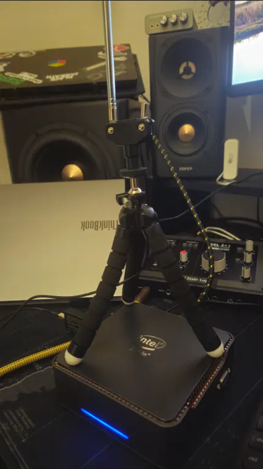
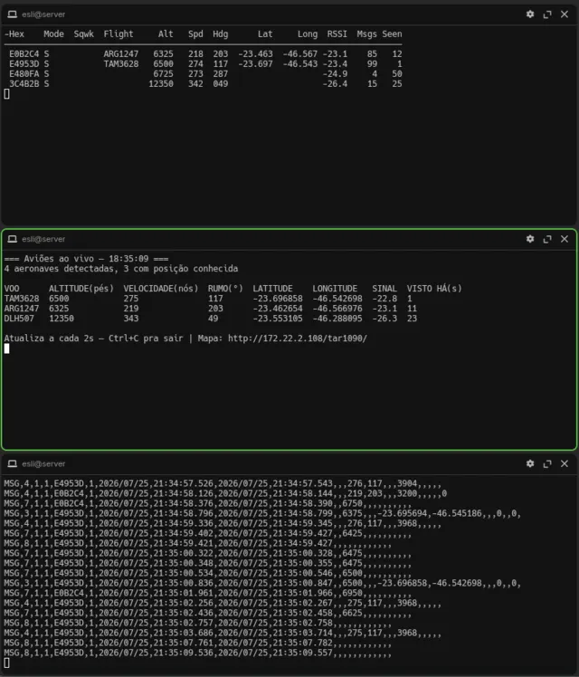
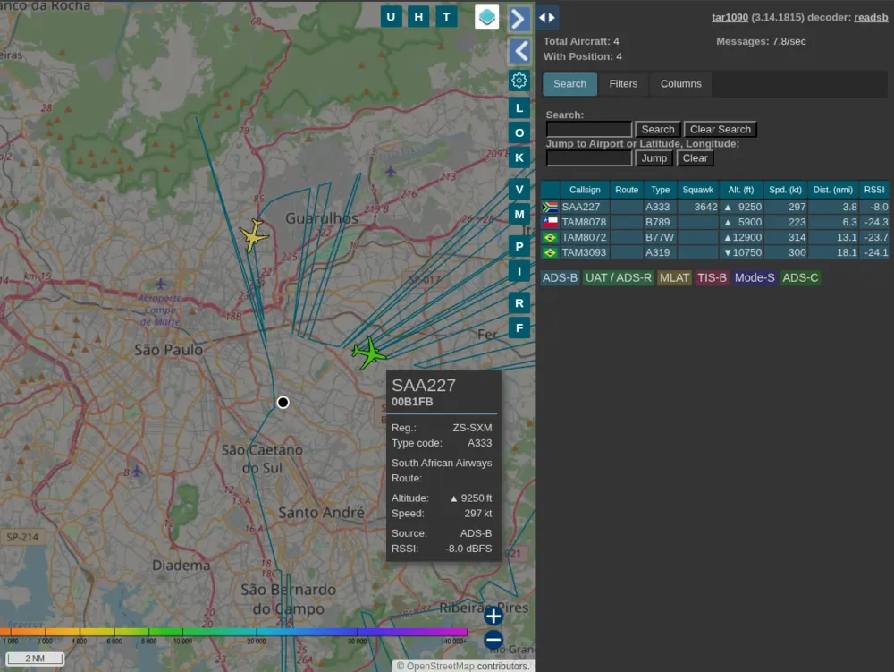

# What easy1090 installs, piece by piece

Four services, no daemons of its own. The installer glues the pieces with permissions, rules and units, and the pieces are these.

## RF layer: the dongle and its driver

### RTL-SDR Blog V4 and the driver fork

The V4 is a standard RTL2832U dongle with an R828D tuner, a 1 ppm TCXO and a stronger front end. The osmocom `rtl-sdr` driver mishandles the V4's quirks, so easy1090 installs `rtl-sdr-blog-git` from the AUR: the fork maintained by the hardware vendor. It is harmless for a V3 or a clone, so there is no model probing and no branching: the fork goes in unconditionally. It ships the utilities the installer uses later (`rtl_test`) plus `rtl_biast` for powering an LNA over bias-tee if you add one.

### The DVB module trap

The Linux kernel will happily claim the dongle as a digital TV tuner (`dvb_usb_rtl28xxu`). `blacklist` in modprobe.d only stops autoload at boot; on hotplug udev asks for the module by alias and the kernel hands it over anyway. easy1090 writes both lines to `/etc/modprobe.d/blacklist-rtlsdr.conf`:

```
blacklist dvb_usb_rtl28xxu
install dvb_usb_rtl28xxu /bin/false
```

The `install ... /bin/false` line is the one that actually closes the door, and it is missing from almost every tutorial.

The station itself on the reference install: the kit's flexible tripod clamped to the homelab mini PC, the small antenna vertical (ADS-B is vertically polarized; a quarter wave at 1090 MHz is about 6.9 cm):



## Decoding: readsb

The decoder is [readsb](https://github.com/wiedehopf/readsb), successor of dump1090: it consumes raw I/Q samples at 1090 MHz, finds transponder preambles, decodes and CRC-validates messages. easy1090 uses `readsb-wiedehopf-git`, not the Mictronics fork that dominates searches:

| | wiedehopf fork | Mictronics fork |
|---|---|---|
| Output format | native `aircraft.json` | binary protobuf (`aircraft.pb`) |
| Every web frontend works | yes | needs an extra converter |
| Maintenance | active (same author as tar1090) | dormant since ~2020 |

It is built with `makepkg` outside `yay`, deliberately, so a `prepare()` patch stays possible the day a new GCC breaks the build. Because of that, `yay -Syu --devel` never sees it, which is why easy1090 ships an `update` command that compares the installed commit against upstream HEAD itself.

### Ports it opens

| Port | Purpose |
|---|---|
| 30001 | raw decoder input |
| 30002 | raw decoder output |
| 30003 | SBS/BaseStation CSV (grep-able, log-friendly) |
| 30004, 30104 | Beast input |
| 30005 | Beast output, what `viewadsb` and feeders read |

The same aircraft as the terminal sees them: `viewadsb` with callsign and RSSI on the left, the SBS CSV stream straight out of port 30003 on the right (TAM, Aerolíneas Argentinas and Lufthansa over the region that day):



### Position and privacy

Your antenna coordinates go into `/etc/default/readsb` and drive range and distance calculations. `JSON_LOCATION_ACCURACY` controls how precisely that position is exposed in the JSON and on the map: exact, approximate, or not published at all. Exact is the default; approximate is the setting worth considering.

## Web layer: tar1090 on lighttpd

[tar1090](https://github.com/wiedehopf/tar1090) is the live map: aircraft read from `/run/readsb/aircraft.json`, trails colored by altitude, a clickable panel per flight enriched with the aircraft database. There is no tar1090 package in the AUR, so easy1090 vendors upstream's official installer, pins it by SHA-256, reviews updates deliberately and runs it as a separate program (see [security](security.md)).

Two extra services enter here as dependencies:

- `jq`, which the tar1090 installer and easy1090 both use for JSON
- `lighttpd`, the web server

Three Arch specific gaps are closed around it, all silent failures. The Arch `lighttpd.conf` is minimal and never reads `conf-enabled`, so everything the tar1090 installer drops there is dead config until easy1090 adds the include. Arch ships lighttpd without `mod_redirect`, so the slash-less URL that the installer prints at the end would 404. And the upstream installer only restarts lighttpd if it was already running, leaving a fresh one dead and disabled. easy1090 handles all three and validates the result with an HTTP check against both URL forms.

## Data sharing: the feeders

Both networks are wired as `--net-connector` lines on the same readsb, opt-in by decision, never by oversight:

- **ADSBExchange** (`feed.adsbexchange.com`) breaks apart into feeding, which is a single connector line, and the stats package, an optional separate service of theirs which generates a feeder UUID to let you claim and track your receiver. Their stats installer does not run on Arch (`adduser` with no fallback), so easy1090 creates the system user first, installs the dependencies they only know how to fetch with `apt`/`yum`, and hands their script over unmodified.
- **airplanes.live** accepts the feed straight from readsb, no extra package needed.

Their own website and stats URLs are printed when you enable. A privacy note showing how exact your position publishing is goes with it.

FlightAware is deliberately not offered: feeding their network requires the `piaware` client with its own registration, and a plain `--net-connector` to their beast port feeds nothing.

## Optional companions: SDR++ and SatDump

Neither decodes ADS-B; they complete the SDR bench.

- **SDR++** (`sdrpp-git`, AUR) is the visual check for RF energy: waterfall and spectrum at 1090 MHz, worth having while pointing the antenna.
- **SatDump** (stable release, not `-git`, on purpose: it is a large C++/CMake project and the tagged version breaks less against system GCC) covers the 137 MHz satellite side, NOAA and Meteor weather imagery. Its build runs around 45 minutes, so the installer asks before starting it.

## The command surface

```
install     idempotent, safe to re-run
update      package versions (yay -Syu --devel, plus readsb commit compare)
feed        enable/disable the public networks, install their stats package
uninstall   best effort reversal, --keep-packages supported
status      what is running, what fell over, what is missing (no sudo)
start/stop/restart   start reboots the three units as a group
open        viewadsb in the terminal, the map URL, the GUIs
```

`status` and `open` never escalate. `restart` knows the dependency order: tar1090 on top of lighttpd on top of readsb.

On a connect to an aircraft, the map answers the classic "what plane is that?" in a tooltip, before opening the full panel: a South African Airways A330 climbing through 9,250 feet, with registration, route, altitude and speed:


