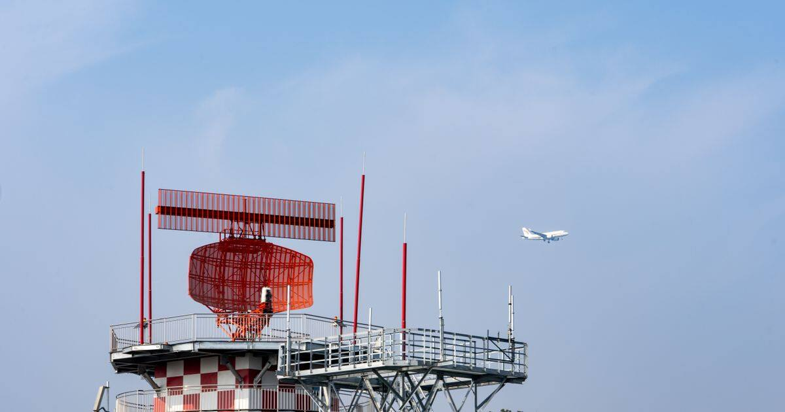
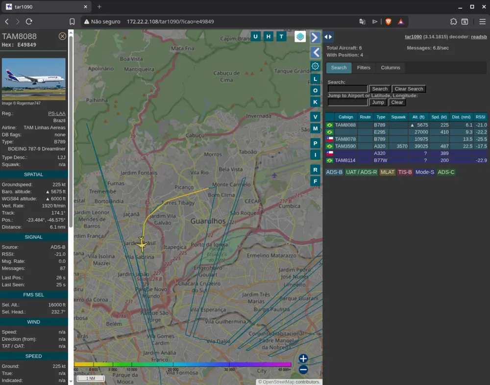
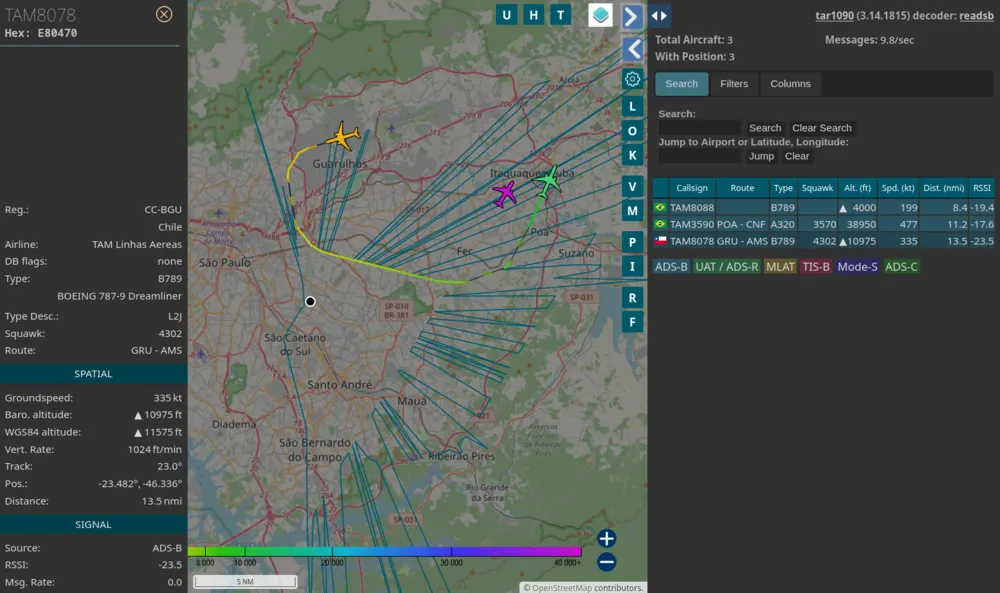
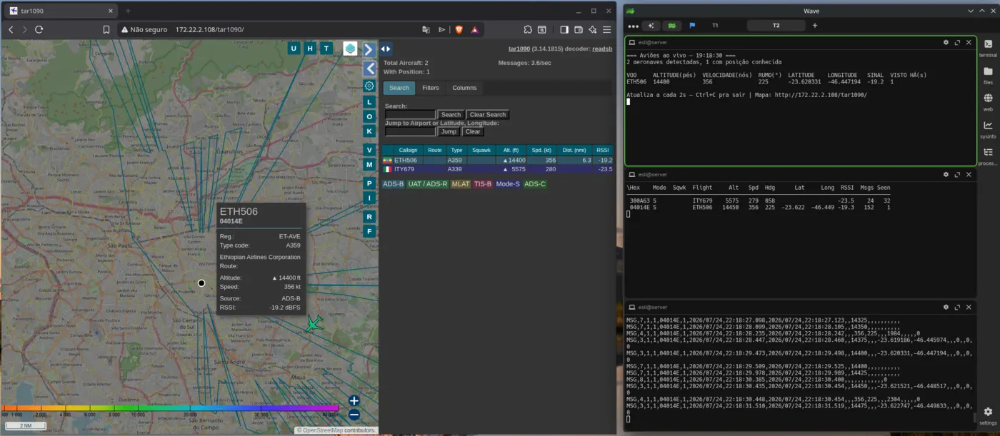

permalink: /
layout: single
title: easy1090
excerpt: "Your own flight tracking, from the RF signal to the map, on Arch Linux, in one command."
last_modified_at: 2026-09-22
---

ADS-B is the signal every aircraft broadcasts on 1090 MHz: position, altitude, speed, callsign, in the open, no subscription, no authentication. easy1090 turns your Arch machine into a receiver for that signal with one command, and deals with every pitfall the generic guides leave out.


*Photo by [Peter Xie](https://www.pexels.com/pt-br/@peter-xie-371876898/) on Pexels.*

## One command

```bash
git clone https://github.com/Esl1h/easy1090.git
cd easy1090
./easy1090 install
```

What it produces on your machine:

- The **correct driver** for the RTL-SDR Blog V4 (the R828D fork, not the osmocom one)
- The kernel DVB module neutralized, at boot **and** on hotplug
- `readsb` decoding ADS-B at 1090 MHz, in JSON, feeding the standard ports
- A live **web map** (`tar1090`) served by `lighttpd` at `http://YOUR-IP/tar1090/`
- `udev` rules, permissions and `systemd` services that survive reboots
- Optional: SDR++ for the RF waterfall and SatDump for the satellite side

Everything is idempotent and converges from your own `install.conf`: run it again after any change and it puts the system back to the state described in the file.

## What it looks like

The map is in the style of Flightradar24, served by your own machine and showing only what your antenna receives:



Clicking an aircraft opens the full panel: registration, company, route, altitude trend, RSSI.



And the raw data is one keystroke away, in the terminal (`viewadsb`, or `nc localhost 30003` for the SBS stream):



Photos and screenshots are from the blog series on real hardware: the homelab server with the antenna on a flex tripod, live terminals and the tar1090 map over Guarulhos.

## Requirements

- Arch Linux or a derivative (EndeavourOS, Omarchy, Manjaro, CachyOS)
- An AUR helper (`yay`)
- An RTL-SDR plugged in, ideally the RTL-SDR Blog V4
- A real terminal, because `sudo` needs a tty

## Try it safely first

```bash
./install.sh --dry-run
```

Read-only preflight, with the exact commands printed: the same lines a real run would execute. Nothing touches root in dry-run mode.

## Context

The manual walkthrough, with the reasoning behind every choice, is the SDR series on the author's blog (in Portuguese):

- [Capturing ADS-B at 1090 MHz with the RTL-SDR v4](https://esli.blog/posts/rtl-sdr-v4-adsb-1090/)
- [From terminal to map: live ADS-B on the web with tar1090](https://esli.blog/posts/rtl-sdr-v4-tar1090/)
- [Practical guide: every way to watch ADS-B in real time](https://esli.blog/posts/guia-visualizacao-adsb/)
- [easy1090: an ADS-B installer for Arch Linux](https://esli.blog/posts/adsb-on-arch-linux/)

This site condenses it, and [the components page][components] continues the job for each installed piece.

[components]: /easy1090/components/
